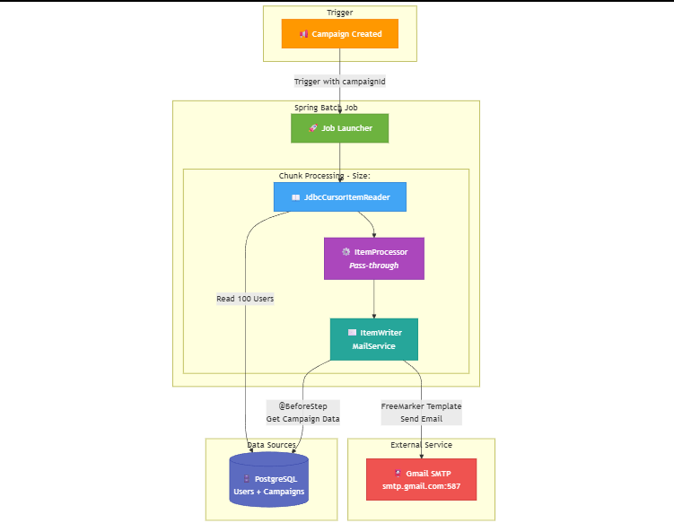

# ⚙️ Spring Batch Example

<div>
<div align="center">
<h3> Project Architecture </h3>

</div>

### Project Summary:

- Triggered within the campaign management processes, this module executes bulk email notifications to the target audience using the Spring Batch architecture. The system relies on the Chunk-Oriented Processing model to ensure resource optimization and transactional integrity. Each cycle processes data in blocks of 100 records , enabling high-volume email delivery in a performant and controlled manner while minimizing database load.

<br>

---

### Tech Stack:

[](https://www.java.com/en/)
[](https://ecma-international.org/)
[](https://spring.io/)
[](https://spring.io/projects/spring-batch)
[](https://freemarker.apache.org/)
[](https://nextjs.org/)
[](https://tailwindcss.com/)
[](https://mapstruct.org/)
[](https://gradle.org/)
[](https://www.red-gate.com/products/flyway/community/)
[](https://www.postgresql.org/)
[](https://springdoc.org/)
[](https://docs.docker.com/)
[](https://docs.docker.com/compose/)

<br>

---

### 🚀 Setup

#### Database Configuration

- **PostgreSQL**
  - **URL:** `http://localhost:5432`
  - **Database:** `batch_db`
  - **Username:** `postgres`
  - **Password:** `postgres`

<br>

#### Mail Configuration

```yaml
# Mail Config
spring:
  mail:
    host: smtp.gmail.com
    port: 587
    username: <email>
    password: <password>
    properties:
      mail:
        smtp:
          auth: true
          starttls:
            enable: true
```

<br>

#### Start Services with Docker Compose

```bash
docker-compose up -d
```

<br>

---

### 📚 API Documentation

#### 👥 User Management

<details>
<summary>➕ Create User </summary>


</details>

<details>
<summary>📋 Get Users </summary>


</details>

<br>

#### 📢 Campaign Management

<details>
<summary>➕ Create Campaign </summary>


</details>

<details>
<summary>📤 Campaign Request </summary>


</details>

<br>

#### 📧 Email Operations

<details>
<summary>✉️ Email Preview </summary>


</details>

<br>

#### 📖 OpenAPI Documentation

<details>
<summary>📄 OpenAPI Specification </summary>


</details>

<br>

### 🐳 Docker Interface

<details>
<summary>🐋 Container Management </summary>


</details>

<br>

---

### 📄 License

This project is licensed under the MIT License. See the [LICENSE](LICENSE) file for details

**Created by** [Mehmet Furkan KAYA](https://www.linkedin.com/in/mehmet-furkan-kaya/)
